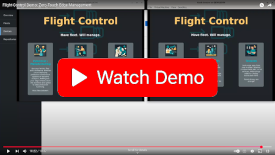

# Flight Control UI

Monorepo containing UIs for [flightctl](https://github.com/flightctl/flightctl)

### Prerequisites:
* `Git`, `Node.js v22.x`, `npm v10.x`, `rsync`, `go` (>= 1.23)

## Building

### Checkout the repo and from within the repo run:

```
npm ci
npm run build
```

### Running Standalone UI with backend running in Kind

Choose one of the two options to run the UI application

  ```
  npm run dev:kind
  ```


### Running Standalone UI with backend not running in Kind
- If backend is not running in your Kind cluster, you need to specify the API endpoint

```
FLIGHTCTL_SERVER=<api_server_url> npm run dev
```

If the backend, or Auth provider is running self-signed certs, you will need to disable the verification via env variables:

 - `FLIGHTCTL_SERVER_INSECURE_SKIP_VERIFY='true'` - to disable verification of backend certs
 - `AUTH_INSECURE_SKIP_VERIFY='true'` - to disable verification of auth server certs

or provide the CA certs:

 - copy backend `ca.crt` to `./certs/ca.crt`
 - copy Auth `ca.crt` to `./certs/ca_auth.crt`

### Running UI as OCP plugin

With this option, the Flight Control UI will run as a Plugin in the OCP console.
**Note**: this setup is only for development, do not use it in Production environments!

Login to OCP cluster and run:

```
npm run dev:ocp 
```

By default, the latest available OpenShift console image will be used. To specify a different console version, set the `CONSOLE_VERSION` environment variable.

The following console versions are confirmed to be compatible: 4.16 to 4.20.

<br><br>

[](https://www.youtube.com/watch?v=WzNG_uWnmzk)

